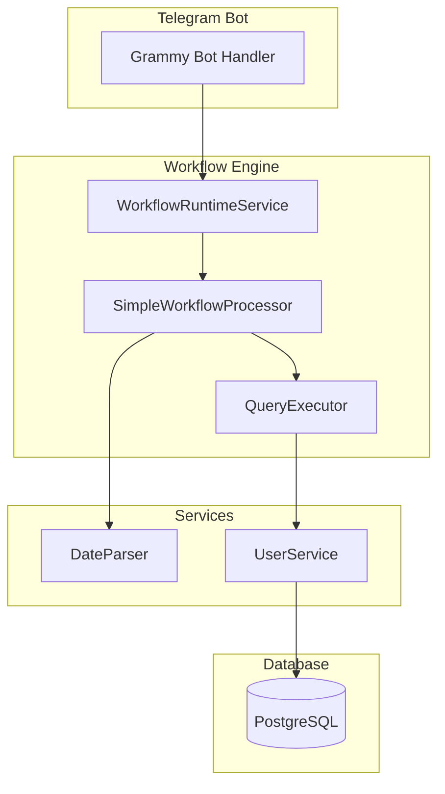
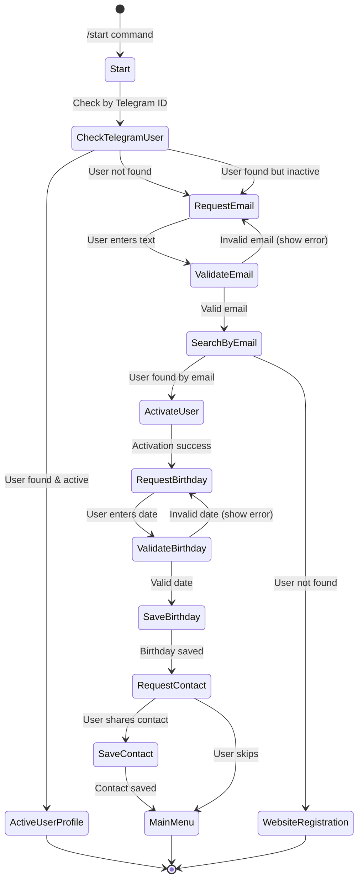

# Design Document: Email Registration Workflow

## Overview

Данный документ описывает дизайн улучшенного сценария регистрации пользователей в Telegram-боте бонусной системы. Ключевые изменения:

1. **Email-first регистрация**: Вместо запроса контакта сначала запрашивается email для идентификации
2. **Сбор дополнительных данных**: После активации последовательно запрашиваются дата рождения и контакт
3. **Расширение модели User**: Добавление поля `metadata` (Json) для хранения произвольных данных

## Architecture

### Компоненты системы



### Workflow Flow



## Components and Interfaces

### 1. DateParser Service

Новый сервис для парсинга и валидации дат рождения.

```typescript
interface DateParserResult {
  success: boolean;
  date?: Date;
  error?: string;
  formatted?: string;
}

interface DateParser {
  parse(input: string): DateParserResult;
  format(date: Date): string;
  validate(date: Date): { valid: boolean; error?: string };
}
```

**Поддерживаемые форматы:**
- `DD.MM.YYYY` (15.03.1990)
- `DD/MM/YYYY` (15/03/1990)
- `DD-MM-YYYY` (15-03-1990)
- `DD.MM` (15.03) - используется текущий год
- `DD/MM` (15/03)
- `DD-MM` (15-03)

**Валидация:**
- Дата не может быть в будущем
- Возраст не может превышать 120 лет
- День и месяц должны быть валидными

### 2. User Metadata Service

Расширение UserService для работы с metadata.

```typescript
interface UserMetadataService {
  getMetadata(userId: string): Promise<Record<string, any>>;
  setMetadata(userId: string, key: string, value: any): Promise<void>;
  updateMetadata(userId: string, data: Record<string, any>): Promise<void>;
  removeMetadataKey(userId: string, key: string): Promise<void>;
}
```

### 3. Workflow Nodes

Новые и модифицированные узлы workflow:

| Node Type | Description |
|-----------|-------------|
| `message.request_email` | Сообщение с запросом email |
| `action.validate_email` | Валидация формата email |
| `action.save_birthday` | Сохранение даты рождения |
| `action.save_contact` | Сохранение контакта |
| `condition.email_valid` | Проверка валидности email |
| `condition.date_valid` | Проверка валидности даты |

### 4. Database Query Extensions

Новые запросы в QueryExecutor:

```typescript
// Обновление даты рождения
update_user_birthday: async (db, params: { userId: string; birthDate: Date }) => {...}

// Обновление metadata
update_user_metadata: async (db, params: { userId: string; metadata: Record<string, any> }) => {...}

// Получение metadata
get_user_metadata: async (db, params: { userId: string }) => {...}
```

## Data Models

### User Model Extension

```prisma
model User {
  // ... existing fields ...
  
  birthDate  DateTime? @map("birth_date") @db.Date  // Уже существует
  metadata   Json?     @default("{}")               // НОВОЕ ПОЛЕ
  
  // ... rest of model ...
}
```

### Metadata Schema

```typescript
interface UserMetadata {
  // Произвольные ключи
  [key: string]: string | number | boolean | null;
  
  // Примеры использования:
  // comment?: string;           // Комментарий администратора
  // preferredLanguage?: string; // Предпочитаемый язык
  // source?: string;            // Источник регистрации
  // customField1?: string;      // Кастомное поле
}
```

### Workflow JSON Structure

Новый шаблон workflow будет содержать следующие узлы:

```json
{
  "nodes": [
    { "id": "start-trigger", "type": "trigger.command" },
    { "id": "check-telegram-user", "type": "action.database_query" },
    { "id": "check-user-status", "type": "condition" },
    { "id": "request-email", "type": "message" },
    { "id": "validate-email", "type": "condition" },
    { "id": "search-by-email", "type": "action.database_query" },
    { "id": "activate-user", "type": "action.database_query" },
    { "id": "request-birthday", "type": "message" },
    { "id": "validate-birthday", "type": "condition" },
    { "id": "save-birthday", "type": "action.database_query" },
    { "id": "request-contact", "type": "message" },
    { "id": "save-contact", "type": "action.database_query" },
    { "id": "success-message", "type": "message" },
    { "id": "main-menu", "type": "message" }
  ]
}
```

## Correctness Properties

*A property is a characteristic or behavior that should hold true across all valid executions of a system-essentially, a formal statement about what the system should do. Properties serve as the bridge between human-readable specifications and machine-verifiable correctness guarantees.*

### Property 1: Email validation rejects invalid formats
*For any* string that does not match email pattern (contains no @ or no domain), the email validator SHALL return invalid result.
**Validates: Requirements 1.3**

### Property 2: Email validation accepts valid formats
*For any* string matching pattern `local@domain.tld`, the email validator SHALL return valid result.
**Validates: Requirements 1.2**

### Property 3: Date parsing round-trip consistency
*For any* valid Date object, formatting then parsing SHALL produce an equivalent date.
**Validates: Requirements 5.1, 5.5**

### Property 4: Date parsing accepts multiple formats
*For any* valid date, parsing strings in formats DD.MM.YYYY, DD/MM/YYYY, DD-MM-YYYY SHALL produce the same Date object.
**Validates: Requirements 5.1**

### Property 5: Short date format uses current year
*For any* valid DD.MM input, parsing SHALL produce a date with the current year.
**Validates: Requirements 5.2**

### Property 6: Future dates are rejected
*For any* date in the future, the date validator SHALL return invalid result with appropriate error.
**Validates: Requirements 5.3**

### Property 7: Very old dates are rejected
*For any* date resulting in age over 120 years, the date validator SHALL return invalid result.
**Validates: Requirements 5.4**

### Property 8: Metadata merge preserves existing keys
*For any* existing metadata object and new key-value pair, updating metadata SHALL preserve all existing keys not being updated.
**Validates: Requirements 4.3**

### Property 9: Metadata null removes key
*For any* metadata object with key K, setting K to null SHALL result in metadata without key K.
**Validates: Requirements 4.4**

### Property 10: Birthday save persists to database
*For any* valid birthday date, saving it to user SHALL result in the same date being retrievable from database.
**Validates: Requirements 2.2, 2.3**

## Error Handling

### Email Validation Errors

| Error | Message | Action |
|-------|---------|--------|
| Empty input | "Пожалуйста, введите email адрес" | Re-request email |
| Invalid format | "Неверный формат email. Пример: example@mail.ru" | Re-request email |
| User not found | "Пользователь не найден. Зарегистрируйтесь на сайте" | Show website link |

### Date Validation Errors

| Error | Message | Action |
|-------|---------|--------|
| Empty input | "Пожалуйста, введите дату рождения" | Re-request date |
| Invalid format | "Неверный формат. Используйте ДД.ММ.ГГГГ или ДД.ММ" | Re-request date |
| Future date | "Дата не может быть в будущем" | Re-request date |
| Too old | "Пожалуйста, введите корректную дату рождения" | Re-request date |

### Database Errors

- Все ошибки БД логируются в SystemLog
- Пользователю показывается общее сообщение об ошибке
- Workflow переходит в состояние error

## Testing Strategy

### Dual Testing Approach

Используем комбинацию unit-тестов и property-based тестов для полного покрытия.

### Property-Based Testing

**Библиотека:** `fast-check` (уже используется в проекте)

**Конфигурация:**
- Минимум 100 итераций на свойство
- Seed для воспроизводимости

**Тестируемые свойства:**
1. DateParser: round-trip, format acceptance, validation
2. Email validation: format checking
3. Metadata operations: merge, delete

### Unit Tests

**Покрытие:**
- DateParser: конкретные примеры форматов
- Email validator: edge cases
- Workflow nodes: integration tests
- Database queries: CRUD operations

### Test File Structure

```
src/lib/services/
├── date-parser.ts
├── date-parser.test.ts          # Unit tests
├── date-parser.property.test.ts # Property tests
└── ...

src/lib/services/workflow/
├── query-executor.ts
├── query-executor.test.ts
└── ...
```

### Test Annotations

Каждый property-based тест должен содержать комментарий:
```typescript
// **Feature: email-registration-workflow, Property 3: Date parsing round-trip consistency**
// **Validates: Requirements 5.1, 5.5**
```
