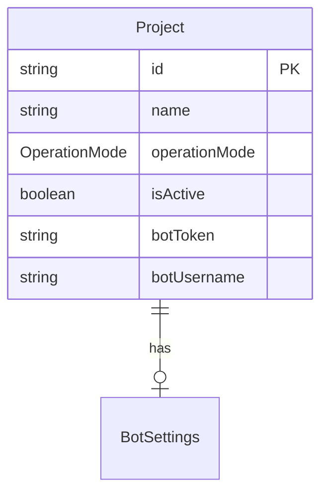
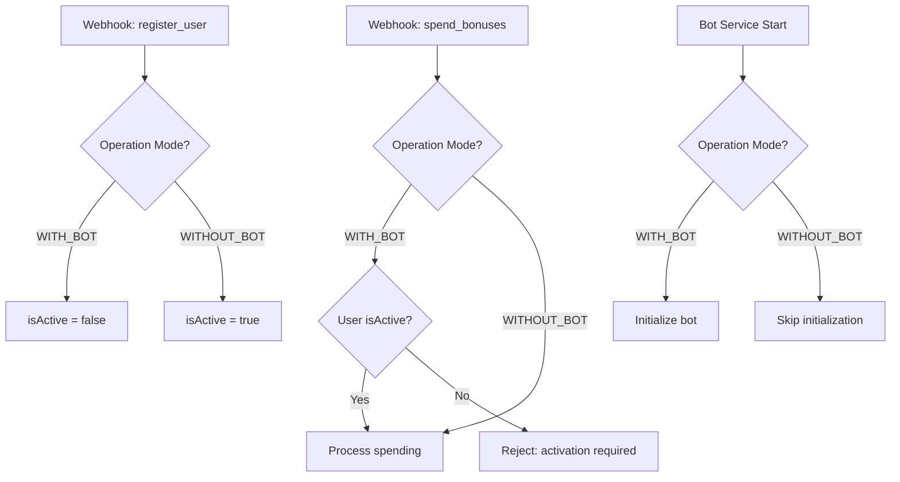

# Design Document: Project Operation Mode

## Overview

Добавление возможности выбора режима работы проекта: с Telegram ботом (WITH_BOT) или без него (WITHOUT_BOT). В режиме WITH_BOT пользователи должны активировать профиль через бота для траты бонусов. В режиме WITHOUT_BOT пользователи автоматически активируются при регистрации и могут тратить бонусы без Telegram.

## Architecture

### Изменения в схеме данных



### Логика работы по режимам



## Components and Interfaces

### Database Schema Changes

```prisma
enum OperationMode {
  WITH_BOT     @map("with_bot")
  WITHOUT_BOT  @map("without_bot")
}

model Project {
  // ... existing fields
  operationMode  OperationMode  @default(WITH_BOT) @map("operation_mode")
}
```

### API Endpoints

```typescript
// PUT /api/projects/[projectId]
interface UpdateProjectRequest {
  // ... existing fields
  operationMode?: 'WITH_BOT' | 'WITHOUT_BOT';
}

// GET /api/projects/[projectId]
interface ProjectResponse {
  // ... existing fields
  operationMode: 'WITH_BOT' | 'WITHOUT_BOT';
}
```

### React Components

```typescript
// OperationModeSelector.tsx
interface OperationModeSelectorProps {
  value: 'WITH_BOT' | 'WITHOUT_BOT';
  onChange: (mode: 'WITH_BOT' | 'WITHOUT_BOT') => void;
  hasExistingUsers: boolean;
  disabled?: boolean;
}

// OperationModeConfirmDialog.tsx
interface OperationModeConfirmDialogProps {
  open: boolean;
  onOpenChange: (open: boolean) => void;
  currentMode: 'WITH_BOT' | 'WITHOUT_BOT';
  newMode: 'WITH_BOT' | 'WITHOUT_BOT';
  existingUsersCount: number;
  onConfirm: () => void;
}
```

### Service Layer Changes

```typescript
// user.service.ts
async function createUser(projectId: string, userData: CreateUserData) {
  const project = await getProject(projectId);
  
  return prisma.user.create({
    data: {
      ...userData,
      projectId,
      // Автоактивация в режиме WITHOUT_BOT
      isActive: project.operationMode === 'WITHOUT_BOT'
    }
  });
}

// webhook-handler.ts
async function handleSpendBonuses(projectId: string, userId: string, amount: number) {
  const project = await getProject(projectId);
  const user = await getUser(userId);
  
  // В режиме WITH_BOT проверяем активацию
  if (project.operationMode === 'WITH_BOT' && !user.isActive) {
    throw new Error('User must activate profile through Telegram bot');
  }
  
  // Процессим списание
  return processSpending(userId, amount);
}

// bot-manager.ts
async function initializeBots() {
  const projects = await prisma.project.findMany({
    where: {
      isActive: true,
      operationMode: 'WITH_BOT',  // Только проекты с ботом
      botToken: { not: null }
    }
  });
  
  for (const project of projects) {
    await initializeBot(project);
  }
}
```

## Data Models

### Migration

```sql
-- Add operation_mode column
ALTER TABLE projects 
ADD COLUMN operation_mode VARCHAR(20) DEFAULT 'with_bot';

-- Create enum type
CREATE TYPE operation_mode AS ENUM ('with_bot', 'without_bot');

-- Update column type
ALTER TABLE projects 
ALTER COLUMN operation_mode TYPE operation_mode 
USING operation_mode::operation_mode;
```

### Default Values

- Новые проекты: `WITH_BOT` (сохраняем текущее поведение)
- Существующие проекты: `WITH_BOT` (миграция не меняет поведение)

## Correctness Properties

*A property is a characteristic or behavior that should hold true across all valid executions of a system-essentially, a formal statement about what the system should do. Properties serve as the bridge between human-readable specifications and machine-verifiable correctness guarantees.*

### Property 1: User activation state depends on operation mode

*For any* new user registration, if the project operates in WITHOUT_BOT mode then isActive should be true, and if the project operates in WITH_BOT mode then isActive should be false.

**Validates: Requirements 2.1, 3.1**

### Property 2: UI visibility adapts to operation mode

*For any* project settings page render, if the project operates in WITHOUT_BOT mode then Telegram configuration options should be hidden, and if the project operates in WITH_BOT mode then Telegram configuration options should be visible.

**Validates: Requirements 2.2, 2.4, 3.2**

### Property 3: Bonus spending authorization depends on mode and activation

*For any* bonus spending request, if the project operates in WITHOUT_BOT mode the request should be processed regardless of user activation status; if the project operates in WITH_BOT mode and user is not active, the request should be rejected.

**Validates: Requirements 2.3, 3.3**

### Property 4: Operation mode persistence

*For any* valid operation mode value saved through the API, querying the project should return the same operation mode value.

**Validates: Requirements 5.1**

### Property 5: Bot service initialization respects operation mode

*For any* project with operationMode = WITHOUT_BOT, the bot service should not attempt to initialize a Telegram bot for that project.

**Validates: Requirements 5.3**

### Property 6: Webhook handler checks operation mode

*For any* webhook request, the handler should retrieve and check the project's operation mode before processing user-related actions.

**Validates: Requirements 5.2**

## Error Handling

| Error Case | Handling |
|------------|----------|
| Invalid operation mode value | Return 400 Bad Request |
| Mode change with active bot sessions | Warn user, require confirmation |
| Spend request from inactive user (WITH_BOT) | Return 403 with activation instructions |
| Bot initialization fails (WITH_BOT) | Log error, mark project as bot error state |

## Testing Strategy

### Unit Tests

- Test `createUser` function with both modes
- Test `handleSpendBonuses` function with both modes and activation states
- Test `initializeBots` filtering by operation mode
- Test React components conditional rendering

### Property-Based Tests

Используем **fast-check** для property-based testing:

- **Property 1**: Generate random user registrations with random modes, verify isActive
- **Property 3**: Generate random spend requests with random modes/activation states, verify authorization
- **Property 4**: Generate random mode values, verify persistence round-trip

### Integration Tests

- Test full flow: change mode → create user → verify activation state
- Test webhook flow: change mode → send spend request → verify behavior
- Test bot service: change mode → restart service → verify bot state
