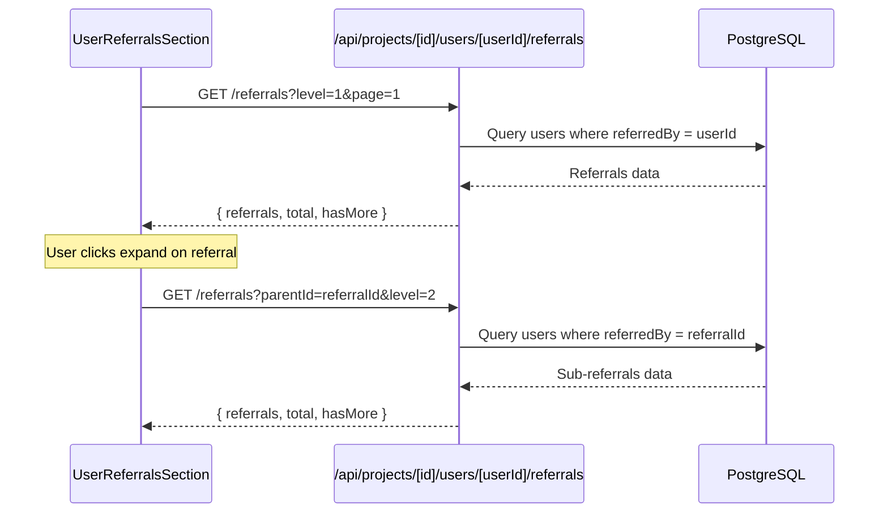

# Design Document: User Referrals Display

## Overview

Добавление секции отображения реферальной сети пользователя в диалог профиля. Функциональность позволяет администратору видеть всех рефералов пользователя с иерархической вложенностью по уровням, статистику по каждому уровню и навигировать по большим реферальным сетям.

## Architecture

### Компонентная архитектура

```
User Profile Dialog
└── UserReferralsSection (новый компонент)
    ├── ReferralStats (статистика)
    ├── ReferralTree (дерево рефералов)
    │   ├── ReferralLevelGroup (группа по уровню)
    │   │   ├── LevelHeader (заголовок с count)
    │   │   └── ReferralList (список рефералов)
    │   │       └── ReferralItem (элемент реферала)
    │   └── LoadMoreButton (пагинация)
    └── EmptyState / ErrorState / LoadingState
```

### Data Flow



## Components and Interfaces

### API Endpoint

```typescript
// GET /api/projects/[projectId]/users/[userId]/referrals
interface ReferralsRequest {
  level?: number;      // Уровень рефералов (1 = прямые)
  parentId?: string;   // ID родительского реферала для подуровней
  page?: number;       // Страница для пагинации
  limit?: number;      // Количество на странице (default: 20)
}

interface ReferralsResponse {
  referrals: ReferralUser[];
  stats: ReferralStats;
  pagination: {
    page: number;
    limit: number;
    total: number;
    hasMore: boolean;
  };
}

interface ReferralUser {
  id: string;
  firstName: string | null;
  lastName: string | null;
  email: string | null;
  phone: string | null;
  registeredAt: Date;
  bonusBalance: number;
  totalEarned: number;
  referralCount: number;  // Количество своих рефералов
  level: number;          // Уровень в иерархии
}

interface ReferralStats {
  totalReferrals: number;
  totalBonusesEarned: number;
  referralsByLevel: { level: number; count: number }[];
}
```

### React Components

```typescript
// UserReferralsSection.tsx
interface UserReferralsSectionProps {
  userId: string;
  projectId: string;
}

// ReferralTree.tsx
interface ReferralTreeProps {
  referrals: ReferralUser[];
  onLoadMore: (parentId: string, level: number) => void;
  onExpand: (referralId: string) => void;
  expandedIds: Set<string>;
  loadingIds: Set<string>;
}

// ReferralItem.tsx
interface ReferralItemProps {
  referral: ReferralUser;
  isExpanded: boolean;
  isLoading: boolean;
  hasChildren: boolean;
  onExpand: () => void;
  children?: React.ReactNode;
}
```

## Data Models

### Database Query

Используем существующую self-relation в модели User:

```prisma
model User {
  // ... existing fields
  referredBy  String?  @map("referred_by")
  referrer    User?    @relation("UserReferrals", fields: [referredBy], references: [id])
  referrals   User[]   @relation("UserReferrals")
}
```

### Query для получения рефералов с вложенностью

```typescript
// Получение прямых рефералов (level 1)
const directReferrals = await prisma.user.findMany({
  where: {
    projectId,
    referredBy: userId
  },
  include: {
    bonuses: {
      where: { isUsed: false }
    },
    _count: {
      select: { referrals: true }
    }
  }
});

// Рекурсивный запрос для подсчёта всех уровней
const getAllReferralsCount = async (userId: string, maxLevel: number = 5) => {
  // CTE query для подсчёта по уровням
};
```

## Correctness Properties

*A property is a characteristic or behavior that should hold true across all valid executions of a system-essentially, a formal statement about what the system should do. Properties serve as the bridge between human-readable specifications and machine-verifiable correctness guarantees.*

### Property 1: Referral grouping by level preserves count accuracy

*For any* referral tree data structure, when grouped by level, the sum of referrals at each level should equal the total count of referrals in the original data.

**Validates: Requirements 1.3, 2.1**

### Property 2: Referral display contains all required fields

*For any* referral user object, the rendered display should contain the referral's name (or email fallback), registration date, and bonus balance.

**Validates: Requirements 2.2**

### Property 3: Referral stats calculation accuracy

*For any* set of referral data, the total referrals count should equal the sum of referrals across all levels, and total bonuses earned should equal the sum of all referral bonus transactions.

**Validates: Requirements 2.3**

### Property 4: Expandable indicator consistency

*For any* referral with referralCount > 0, the UI should display an expandable indicator; for referrals with referralCount = 0, no expandable indicator should be shown.

**Validates: Requirements 2.4**

### Property 5: Pagination preserves data integrity

*For any* paginated referral list, fetching all pages and concatenating results should produce the same set of referrals as fetching without pagination (order may differ).

**Validates: Requirements 4.2**

## Error Handling

| Error Case | Handling |
|------------|----------|
| API request fails | Show error message with retry button |
| User has no referrals | Show empty state with informative message |
| Network timeout | Show timeout error, allow retry |
| Invalid userId | Return 404 from API |
| Unauthorized access | Return 403 from API |

## Testing Strategy

### Unit Tests

- Test `groupReferralsByLevel` utility function
- Test `calculateReferralStats` utility function
- Test API route handler with mocked Prisma
- Test React components with React Testing Library

### Property-Based Tests

Используем **fast-check** для property-based testing:

- **Property 1**: Generate random referral trees, verify grouping preserves counts
- **Property 3**: Generate random referral data, verify stats calculations
- **Property 4**: Generate referrals with varying referralCount, verify indicator logic
- **Property 5**: Generate large datasets, verify pagination integrity

### Integration Tests

- Test full flow: open profile → load referrals → expand level → load sub-referrals
- Test error states and retry functionality
- Test pagination with large datasets
