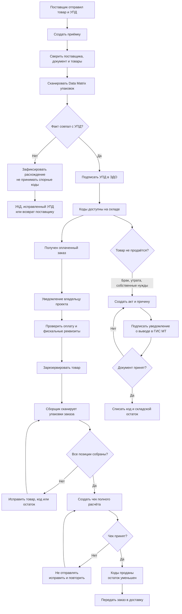

# Полный цикл маркированного товара

Документ описывает целевой пользовательский и технический процесс Gupil: от поставки товара до продажи, отправки, возврата или отдельного списания. Процесс должен учитывать сразу три независимых контура:

1. физический товар на складе;
2. право собственности и документы ЭДО/ГИС МТ;
3. заказ, оплата и фискальный чек.

Изменение только одного контура не означает, что два остальных завершены.

## Основной процесс

## 1. Приёмка от поставщика

Сотрудник открывает раздел «Приёмки» и создаёт документ на основании входящего УПД. Система показывает поставщика, номер и дату документа, ожидаемые товары и количество.

Для каждой физической упаковки сотрудник сканирует Data Matrix. Gupil должен:

- распарсить GTIN и серийный номер;
- сопоставить GTIN с каталогом;
- исключить дубликат кода;
- проверить количество и, когда доступно, статус кода через ГИС МТ;
- сохранить код как складскую единицу, ещё не связанную с заказом.

Если фактическая поставка расходится с УПД, спорные позиции нельзя автоматически принимать. Пользователь фиксирует недостачу, лишний товар, неверный GTIN, повреждение или уже выбывший код. После исправленного УПД/УКД либо возврата поставщику приёмка завершается.

Подписание УПД в ЭДО подтверждает передачу товара между участниками оборота. Простое увеличение `stockOnHand` в Gupil этого не заменяет.

## 2. Склад после приёмки

У маркированной единицы должны быть отдельные состояния:

| Состояние      | Значение                                   |
| -------------- | ------------------------------------------ |
| `EXPECTED`     | указана в поставке, но ещё не принята      |
| `AVAILABLE`    | принята и доступна для продажи             |
| `RESERVED`     | закреплена за заказом                      |
| `PICKED`       | отсканирована сборщиком                    |
| `SALE_PENDING` | отправлена в фискальный чек                |
| `SOLD`         | чек принят, товар реализован               |
| `RETURNED`     | возвращена покупателем и ожидает решения   |
| `WRITTEN_OFF`  | выведена не через розничную продажу        |
| `QUARANTINED`  | ошибка или расхождение, операции запрещены |

Для немаркированных товаров достаточно количественного остатка. Для маркированных остаток должен подтверждаться списком доступных кодов, а не только числом.

## 3. Новый заказ и резерв

После получения заказа Gupil создаёт уведомление со ссылкой на карточку заказа. Менеджер видит источник, сумму, оплату, готовность каталога и необходимость маркировки.

После подтверждения оплаты система резервирует нужное количество товара. В целевой версии конкретные Data Matrix можно выбирать автоматически по FIFO/FEFO, но окончательная проверка происходит при физической сборке.

Если товара недостаточно, заказ получает блокирующее состояние «Нет доступного остатка». Отправка и фискализация полного расчёта недоступны.

## 4. Сборка и сканирование

Сборщик открывает заказ, берёт физическую упаковку и сканирует её 2D-сканером. Система принимает код только если:

- он является полным Data Matrix, а не одним GTIN;
- GTIN совпадает с товаром заказа;
- код принят на склад и доступен либо уже зарезервирован этим заказом;
- код не продан, не списан и не закреплён за другим заказом;
- число отсканированных упаковок не превышает количество в заказе.

Ошибочный код остаётся в поле, а интерфейс объясняет конкретную причину и действие: сменить товар, повторить сканирование, проверить приёмку или снять чужой резерв.

## 5. Реализация и выбытие

Онлайн-оплата и реализация — разные события. Первый чек может фиксировать предоплату, а чек полного расчёта формируется при передаче товара покупателю в соответствии с настроенным кассовым сценарием.

После комплектации Gupil создаёт через ЮKassa чек полного расчёта с кодами маркировки. До подтверждения чека коды находятся в `SALE_PENDING`, а отправка заблокирована. После успешного ответа:

- коды получают состояние `SOLD`;
- резерв и фактический складской остаток уменьшаются одной транзакцией;
- создаётся движение склада `SALE`;
- заказ становится готовым к передаче в доставку.

При розничной продаже сведения о маркированной единице передаются в ГИС МТ через оператора фискальных данных. Успешное внутреннее движение склада без успешного фискального контура не считается подтверждённым выбытием.

## 6. Отправка

Кнопка «Отправлен» доступна только когда одновременно выполнены условия:

- оплата подтверждена;
- каталог заказа настроен;
- все обязательные Data Matrix отсканированы;
- чек полного расчёта успешно принят;
- складская продажа зафиксирована.

После передачи перевозчику сохраняются служба доставки, трек-номер, время и сотрудник. Доставка не изменяет статус кода в ГИС МТ: юридически значимое выбытие уже связано с фискальным документом.

## 7. Отмена и возврат покупателя

До отправки чека код можно снять с заказа и вернуть в `AVAILABLE`. После успешной реализации простого удаления недостаточно: нужен возвратный кассовый сценарий, а допустимость возврата кода в оборот зависит от товарной группы, состояния упаковки и основания операции.

Возвращённый товар сначала помещается в `RETURNED`/`QUARANTINED`. Только после проверки кода и успешного юридического документа он снова становится `AVAILABLE`; иначе оформляется отдельное списание.

## 8. Брак, утрата и другое списание

Непродажное списание нельзя проводить тем же действием, что продажу. Пользователь выбирает основание, сканирует конкретные коды, прикладывает внутренний акт и формирует уведомление о выводе из оборота в ГИС МТ. Документ подписывается уполномоченной электронной подписью.

Складской остаток уменьшается только после принятия внешнего документа либо попадает в состояние «Требует сверки», если ответ не получен. Для каждого кода сохраняются основание, внешний идентификатор документа, автор и время.

## Текущее покрытие Gupil

Уже реализовано:

- каталог с GTIN и фискальными реквизитами;
- получение заказов Tilda;
- подтверждение оплаты;
- сканирование Data Matrix непосредственно в заказ;
- формирование чека полного расчёта через ЮKassa;
- блокировка отправки до завершения обязательных этапов;
- журнал фискальной очереди и повторные попытки.

Необходимо реализовать следующим этапом:

1. документы приёмки и расхождений;
2. складской реестр Data Matrix, не зависящий от заказа;
3. резерв и отпуск конкретных складских единиц;
4. интеграцию с ЭДО/УПД;
5. проверку статусов и документы непроизводственного выбытия через ГИС МТ;
6. возвратный чек и контролируемый возврат кода в оборот;
7. сверку Gupil — ЮKassa/ОФД — ГИС МТ.

Текущая модель `MarkedUnit`, где `orderId` и `orderItemId` обязательны, подходит для сборки заказа, но не для приёмки. Перед созданием экрана приёмки модель нужно расширить отдельной сущностью складской маркированной единицы либо сделать связь с заказом опциональной и добавить источник поставки, складской статус и историю операций.

## Официальные основания процесса

- Передача/приёмка товара выполняется с использованием УПД и ЭДО: <https://markirovka.ru/knowledge/tovarnye-gruppy/tabachniye-izdeliya/peredacha-priemka-tovarov-tabak>
- При розничной реализации сведения передаются через ОФД; для иных причин формируется отдельное уведомление о выводе: <https://markirovka.ru/knowledge/fast_start/start/vyvod-markirovannoy-produktsii-iz-oborota-prichiny-i-sposoby>

Конкретный состав УПД, разрешённые режимы объёмно-сортового/поэкземплярного учёта и возврата необходимо проверять для товарной группы и даты операции. Этот документ описывает безопасную целевую архитектуру, а не заменяет настройку юридического сценария конкретной организации.
